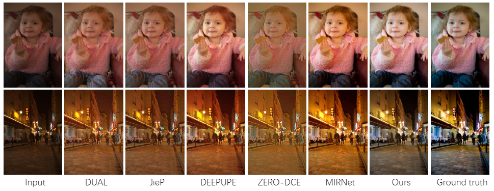

# SMNet
SMNet: Synchronous Multi-scale Low Light EnhancementNetwork with Local and Global Concern.

by SHIDENG LIN, FAN TANG, WEIMING DONG, XINGJIA PAN and CHANGSHENG XU.

The SMNet has good performance to enhance low-light images.
## Abstract
Limited by objectively poor lighting conditions and hardware devices, low-light images with low visual quality and low visibility are inevitable in the real world.
Accurate local details and reasonable global information play their important and distinct roles for low-light image enhancement: local details contribute to fine textures while global information is critical for proper understanding of global brightness level.
In this paper, we focus on integrating both local and global aspects to achieve high-quality low-light image enhancement by proposing the synchronous multi-scale low light enhancement network (SMNet).
A synchronous multi-scale representation learning structure and a global feature recalibration module are adopted in SMNet.
Different from traditional multi-scale feature learning architecture, SMNet carries out the multi-scale representation learning in a synchronous way: we first calculate the rough contextual representations in a top-down manner and then learn multi-scale representations in a bottom-up way to generate representations with rich local details.
To acquire global brightness information, a global feature recalibration module (GFRM) is applied after the synchronous multi-scale representations to perceive and exploit proper global information by global pooling and projection to recalibrate channel weights globally.
The synchronous multi-scale representation and GFRM compose the basic local-and-global (L&G) block. 
By stacking several L&G blocks, the proposed SMNet could enhance the input low light images by applying local representation and global recalibration.
With above considerable structures, our model generates high quality outputs.
Experimental results on mainstream real-world dataset LOL and synthetic dataset MIT-Adobe FiveK show that the proposed SMNet not only leads the way on objective metrics but also is superior in subjective comparisons compared with typical SoTA methods. 
The implement code had already been uploaded to: https://github.com/linshideng/SMNet. 
## Method

## Results




## Requirements
SMNet is built by:
- python 3.7.3
- pytorch 1.1.0
- scikit-image   0.14.5  
- scipy   1.1.0     
- opencv-python    4.1.1.26   
- pillow   5.2.0 

## Usage
Tips:
-  The h/w resolution of all input images shall be divided by 4, such as 600*400.
-  We provide a few test images in `./dataset`.
### Testing
To test the pre-trained model on LOL dataset, just run:
```
bash test.sh
```

or run:

```
python test.py  --test_folder  path_to_images  --output save_images_here  --modelfile pretrained_model --modeltype lol
```
Example:
```
python test.py  --test_folder  ./datasets/LOL/test/low  --output  ./output_test  --modelfile ./model_LOL.pth --modeltype LOL
```
- You can change the `--test_folder` to test your own dataset.
- You can use the pretrained model training on Adobe-MIT FiveK dataset by `--modelfile ./model_FIVEK.pth --modeltype FIVEK`
### Training
Before training  on your own dataset, you should place images like 
- your_dataset
  - train
    - high
    - low
  - test
    - high
    - low

moreover, you should use the `vgg16.pth` for perceptual loss. The file has been uploaded to [Baidu Netdisk](https://pan.baidu.com/s/1QIV50-mN_3NpMg2BYbKM7Q)(code: hzfs) and [Goole Drive](https://drive.google.com/file/d/1b1odcQXTSJSnWZBu3PWPDei9zYTFIxSu/view?usp=sharing). And please change the **absolute path** in line 56 of `lib/utils.py`.  

`train` `low`/`high` includes low-light images and their ground truth for training, while `test` `low`/`high ` includes low-light images and their ground truth for testing.

To train the model, just run:

```
bash train.sh
```
or run:
```
python train.py --trainset  path_to_trainset  --testset path_to_testset  --output  save_inter_images
```
Example:
```
python train.py --trainset  ./datasets/LOL/train  --testset  ./datasets/LOL/test  --output  ./output
```
